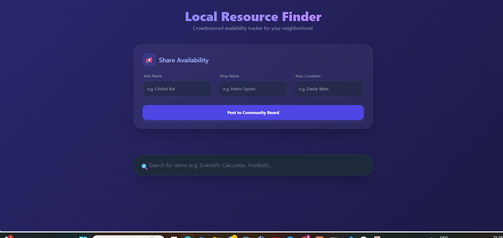
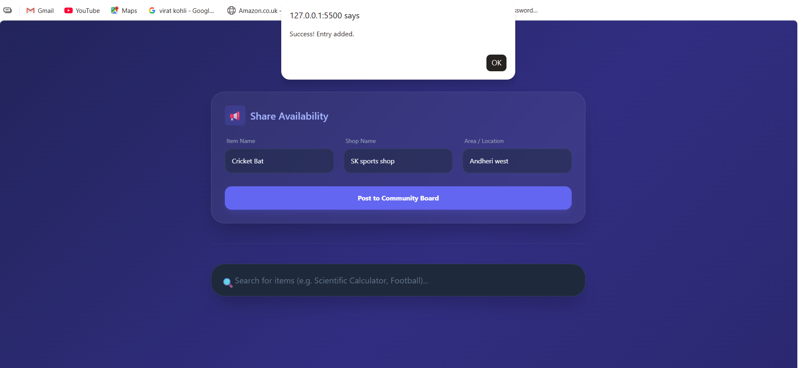
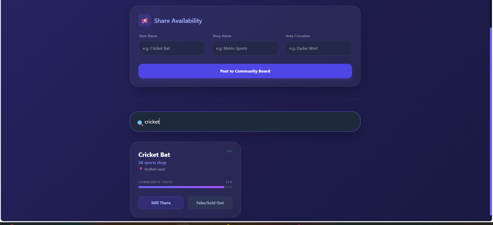
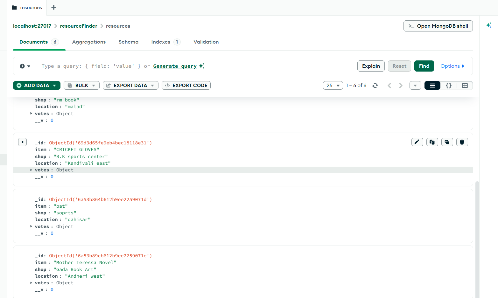

# Resource Finder

## Overview
Resource Finder is a web application that helps users search and find useful resources. It is built using Node.js, Express.js, MongoDB, HTML, CSS, and JavaScript.

## Features
- Search resources
- Add new resources
- MongoDB database integration
- Responsive user interface
- Fast and easy to use

## Tech Stack
- HTML
- CSS
- JavaScript
- Node.js
- Express.js
- MongoDB

## Project Structure

```
Resource_Finder/
│── app.js
│── server.js
│── index.html
│── style.css
│── package.json
│── package-lock.json
│── .gitignore
```

## Installation

```bash
git clone https://github.com/ajayrai-eng/Resouce_Finder.git
cd Resouce_Finder
npm install
npm start
```

## Screenshots

### Home Page



### Add Resource



### Search Results



### MongoDB Database



## Author

**Ajay Rai**
